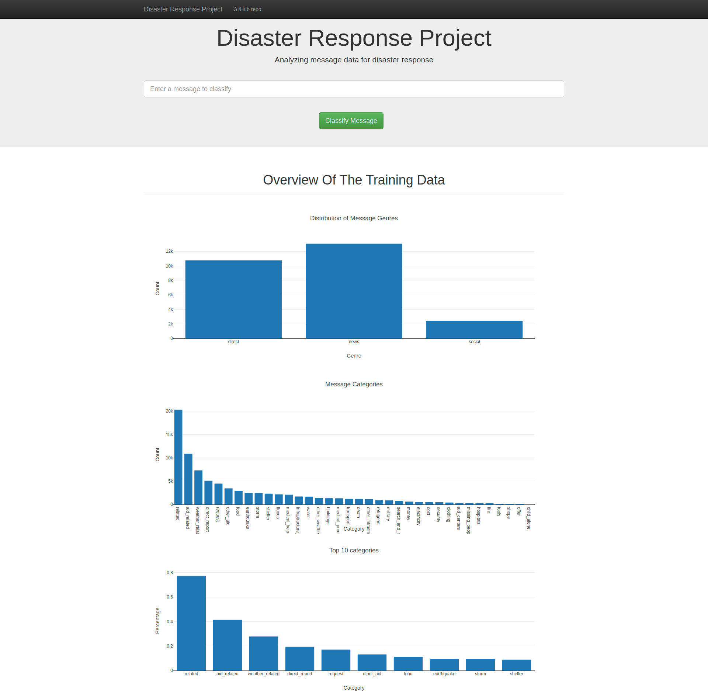
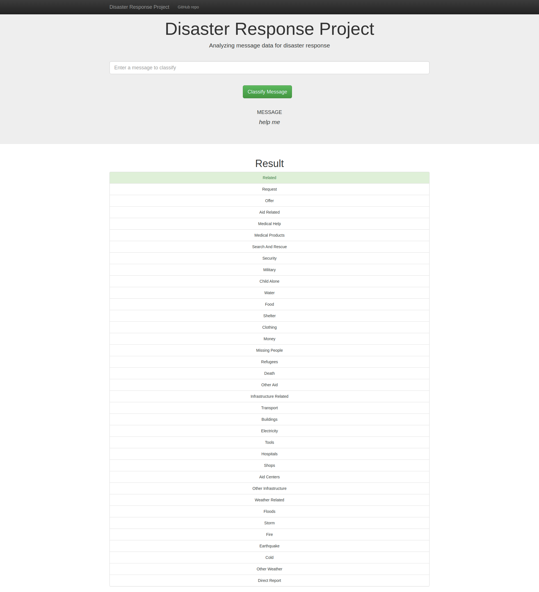

# Disaster-Response-Pipeline
A machine learning pipeline to categorize emergency messages based on the needs communicated by the sender.

## Table of contents
* [Project phases](#project-phases)
* [Repo's Files](#Repos-Files)
* [Required Packages](#required-packages)
* [Instructions](#instructions)
* [Acknowledgements](#acknowledgements)
* [Screenshots](#screenshots)

# Project phases:

1. ETL (Extracting, transforming and loading the data), then preprocessing it before modeling.

2. Modeling the data to classify the disaster messages through ML and NLP pipelines.

3. Building a simple web app to visualize the results.

## Data impalance problem:

- This dataset is impalanced, as most instances in the dataset is falls under "related" category and other categories like "child_alone" have less or no instances, that makes the model classify all messages as "related".
- One way to solve this problem is to gather more data of these other categories, under-sampling "related" category or over-sampling those other categories.

## Repo's Files:
```
.
├── app
│   ├── run.py	# runs flask app
│   └── templates	# html pages
│       ├── go.html	# message classification page
│       └── master.html	# homepage
├── data
│   ├── disaster_categories.csv	# categories data
│   ├── disaster_messages.csv	# messages data
│   ├── DisasterResponse.db	# sqllite database stores messages+categories
│   └── process_data.py	# data cleaning, preprocessing, saving to database
├── models
│   ├── classifier.pkl	# trained_model
│   └── train_classifier.py	# loading data from database, training model and evaluating it
├── README.md	# this file
└── Screenshots
    ├── data_visualization.png	# simple analysis of training data
    └── message_classification.png	# message classification result


```


## Required Packages:

- python3
- pandas
- sqlalchemy
- sklearn
- nltk
- re
- pickle
- flask
- plotly


## Instructions:

1. Run the following commands in the project's root directory to set up your database and model.

    - To run ETL pipeline that cleans data and stores in database
        `python data/process_data.py data/disaster_messages.csv data/disaster_categories.csv data/DisasterResponse.db`
    - To run ML pipeline that trains classifier and saves
        `python models/train_classifier.py data/DisasterResponse.db models/classifier.pkl`

2. Run the following command in the app's directory to run your web app.
    `python app/run.py`

3. Go to http://0.0.0.0:3001/


## Acknowledgements:

- This project was done as a part of Udacity's Data Scientist Nanodegree.
- Data is from [Figure Eight.](https://appen.com/)

## Screenshots:




